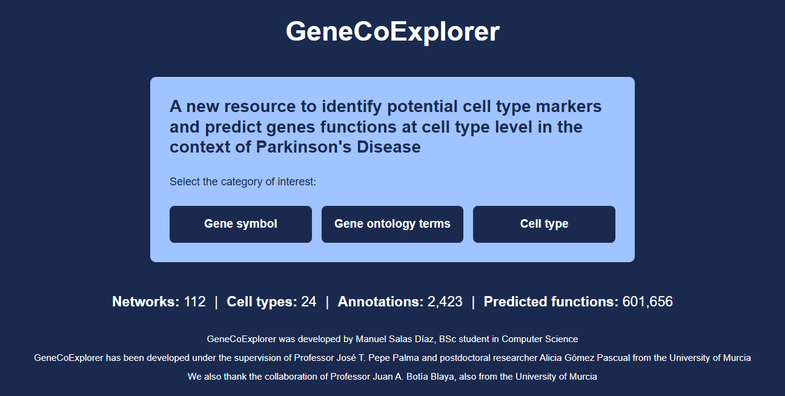

## GeneCoExplorer

GenCoExplorer is an API web to identify potential cell type markers and predict genes functions at cell type level in the context of Parkinson's Disease. 

## Datasets

The datasets being used are scRNA-seq networks of postmortem samples from 27 donors (13 controls and 14 Parkinson's cases) from the most studied brain region in Parkinson's disease, the substantia nigra pars compacta. They come from the repository [scCoExpNets](https://github.com/aliciagp/scCoExpNets).

## How to use it

To deploy the tool developed in this Final Degree Project, you must first access the GitHub repository where all the necessary data and code are stored.

Once in the repository, click on the **Code** button, which will display a dropdown menu with several options. You can either clone the repository or download a `.zip` file containing all the contents.

In any case, once the repository has been downloaded, navigate to the folder named `code`, and execute the file named `QueryAPI.py`.

You must run this file, which will provide an address and a port that you can access through a web browser. For example, by copying the URL `http://127.0.0.1:5000`, into the browser's address bar, the tool’s main page will appear, and you will be able to start using it.

## First look

On the home page of the API, there are three types of queries: by gene symbol, GO term, or cell type.
All of them have a similar structure. At the top there are headers for switching between queries. Ot the left panel, there is a `Run example` button that autocompletes the filters and the search bar. Here is an example of a gene symbol query:

