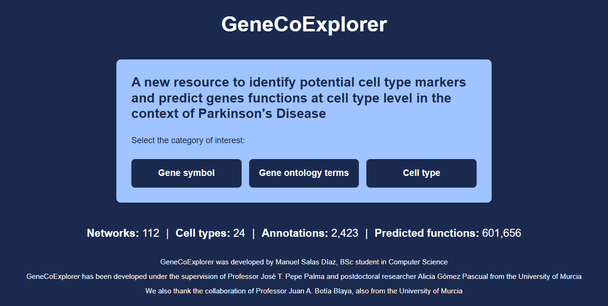
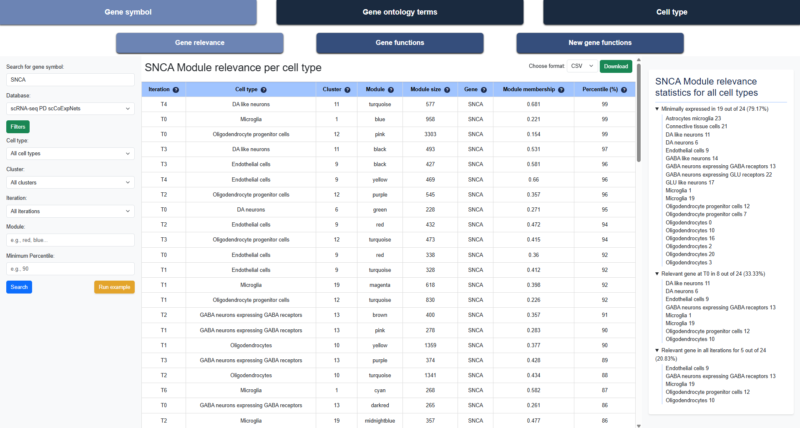

## GenCoExplorer

GenCoExplorer is an API web to identify potential cell type markers and predict genes functions at cell type level in the context of Parkinson's Disease. It uses the database from [scCoExpNets](https://github.com/aliciagp/scCoExpNets).

## How to use it

Para poder desplegar la herramienta de este TFG, primero se debe acceder al repositorio de GitHub donde se encuentran almacenados todos los datos y el código necesarios.

Una vez en el repositorio, haz clic en el botón **Code**, lo que mostrará un desplegable con varias opciones. Puedes clonar el repositorio o bien descargar un archivo `.zip` con todo el contenido.

En cualquier caso, una vez descargado el repositorio, deberás ir a la carpeta llamada `code`, en la cual se encuentra el fichero principal `QueryAPI.py`.

Debes ejecutar este fichero, el cual proporcionará una dirección y un puerto a los que podrás acceder a través de un navegador. Por ejemplo, copiando en la barra de direcciones la URL `http://127.0.0.1:5000`, aparecerá la portada principal de la herramienta, y ya podrás comenzar a trabajar con ella.

## First look

At the home page of the API, there're three types of queries searching by: gene symbol, GO term, or cell type. 
All of them have a similar structure, at the top there're headers for changing beetwen queries. At the left panel there's a `Run example` button that autocompletes the filters and the search bar. Here an example for a gene symbol query.

